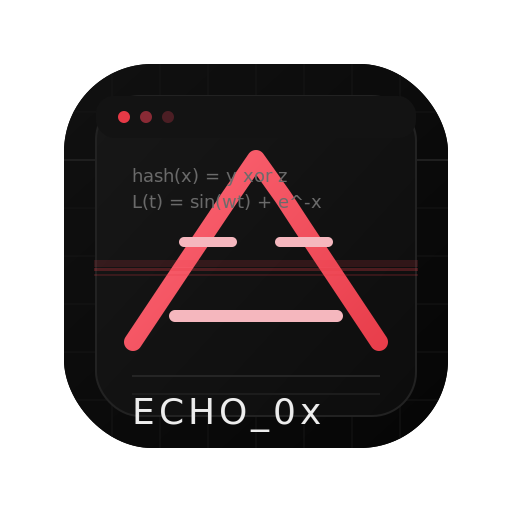
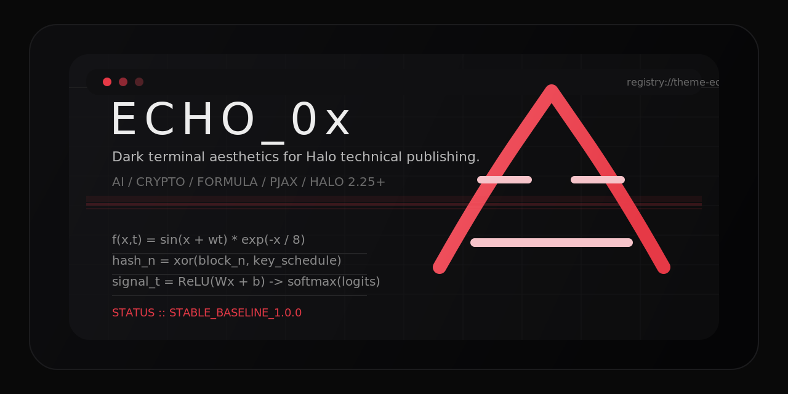

# Echo 0x

> A Halo theme with a dark terminal aesthetic for security, AI, and technical writing.

Echo 0x 是一款面向 Halo 2.25+ 的暗色终端风格主题，适用于安全研究、AI 记录、开发随笔与技术博客场景。主题围绕“终端感、公式感、秩序感”构建视觉体验，同时保留 Halo 主题在内容展示、模板扩展与后台配置上的灵活性。

<p align="center">
  
</p>

<p align="center">
  
  
  
</p>

<p align="center">
  
</p>

## 项目概览

- 适配 Halo 2.25 及以上版本
- 提供暗色终端风格与可切换明暗模式
- 支持实时计算的数学动画封面
- 支持文章、标签、分类、归档、作者与独立页面模板
- 支持首页数据面板、章节导航与页面切换特效
- 适合安全、密码学、深度学习与工程类内容发布

## 核心特性

- 多种封面风格：支持 AI、密码学、原风格三类主题，以及随机混合模式
- 数学动画封面：封面图形由前端实时计算渲染，强调公式感与技术表达
- 终端式视觉系统：统一的配色、字重、边框与布局节奏
- Halo 原生集成：通过主题配置项控制强调色、封面风格、数据面板与页面特效
- 完整内容结构：覆盖首页、文章页、归档页、标签页、分类页、作者页与友情链接页
- 响应式布局：适配桌面端、平板与移动端浏览

## 安装

### 方式一：通过 Halo 后台上传

1. 打开 [Releases](https://github.com/Urban-Ash/theme-echo-0x/releases/latest) 下载最新安装包 `1.0.0.zip`
2. 进入 Halo 后台，打开“主题”
3. 选择“安装主题”，上传下载好的 ZIP 文件
4. 安装完成后启用 `Echo 0x`

### 方式二：通过目录部署

1. 克隆或下载当前仓库
2. 将 `theme-echo-0x` 目录放入 Halo 的 `templates/themes` 目录
3. 返回 Halo 后台并启用该主题

## 版本与发布

- 当前稳定基线版本：`1.0.0`
- Release 页面：[GitHub Releases](https://github.com/Urban-Ash/theme-echo-0x/releases)
- 更新记录见 [docs/CHANGELOG.md](docs/CHANGELOG.md)

## 开发

开发说明与协作规范见：

- [docs/development.md](docs/development.md)
- [AGENTS.md](AGENTS.md)

本地打包命令：

```bash
python3 build.py
```

## 文档

- [用户使用指南](docs/README.md)
- [版本更新日志](docs/CHANGELOG.md)
- [1.0.0 发布说明](docs/RELEASE-1.0.0.md)
- [开发者指南](docs/development.md)

## License

MIT
